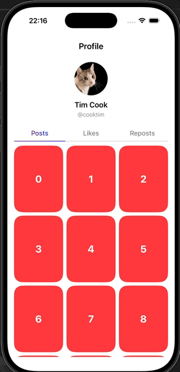

# Profile Page

Profile Page is an iOS UI prototype of a modern social-media profile screen with a sticky header and horizontally paged content (like TikTok or Instagram).  
The project focuses on scroll synchronization, gesture handling, and custom container controller behavior using UIKit.

Implemented for iOS 15+ and intended as a UI demonstration rather than a production app.

## Demo

<p align="center">
  
</p>

---

## Architecture Overview

The profile screen is built around a custom container view controller that coordinates:

- a sticky profile header
- a tab bar
- horizontally paged scrollable content
- synchronized vertical scrolling across pages

---

## View Hierarchy
UINavigationController
```text
UINavigationController
 └── ProfileViewController
     ├── HeaderContainerView
     │   └── UserInfoView
     ├── MenuBar
     └── ProfilePageViewController (UIPageViewController)
         ├── GridViewController (ScrollableViewController)
         │   └── UICollectionView
         ├── GridViewController (ScrollableViewController)
         │   └── UICollectionView
         └── GridViewController (ScrollableViewController)
             └── UICollectionView
```


## Installation

Clone the repository and use it as example for your design:
   ```
   git clone https://github.com/talazaren/ProfilePage.git
   ```

